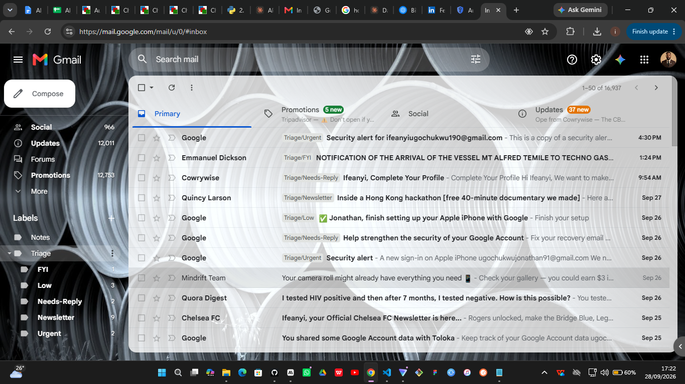
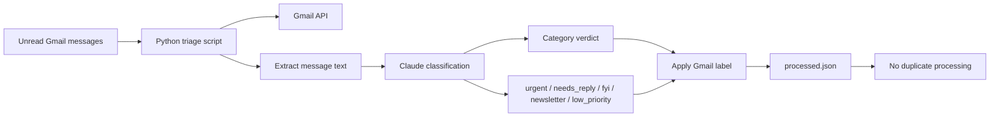

# Email Triage

A lightweight Gmail triage tool that reads unread inbox mail, classifies each message with Claude, and applies Gmail labels such as `Triage/Urgent`, `Triage/Needs-Reply`, and `Triage/FYI`.

## What it does

- Fetches unread Gmail messages from your inbox
- Extracts the most relevant message text from the email body
- Sends the message to Claude for classification
- Adds the matching Gmail label
- Keeps a local `processed.json` file so repeated runs do not reprocess the same messages

## Why this exists

This keeps a noisy inbox from dominating your attention. The script is intentionally conservative:

- it only adds labels
- it never deletes mail
- it never archives, replies, or forwards messages
- it is designed to be easy to undo if a classification is wrong

## Requirements

- Python 3.10+
- A Gmail account with API access
- A Google Cloud project with the Gmail API enabled
- An Anthropic API key

## Setup

1. Create a virtual environment:

   ```powershell
   python -m venv .venv
   .\.venv\Scripts\Activate.ps1
   ```

2. Install dependencies:

   ```powershell
   .\.venv\Scripts\python.exe -m pip install anthropic google-api-python-client google-auth-oauthlib
   ```

3. In Google Cloud Console:
   - create a project
   - enable the Gmail API
   - create an OAuth client ID of type "Desktop app"
   - download the JSON and save it as `credentials.json` in the project directory

4. Set your Anthropic API key:

   ```powershell
   $env:ANTHROPIC_API_KEY = "your-api-key"
   ```

5. Run the script in dry-run mode first:

   ```powershell
   .\.venv\Scripts\python.exe email_triage.py --dry-run
   ```

   This will classify and print results without changing Gmail.

6. When you are ready to apply labels:

   ```powershell
   .\.venv\Scripts\python.exe email_triage.py
   ```

## Usage

```powershell
# Preview only
.\.venv\Scripts\python.exe email_triage.py --dry-run

# Process up to 25 unread inbox messages
.\.venv\Scripts\python.exe email_triage.py

# Process up to 50 emails with a custom Gmail query
.\.venv\Scripts\python.exe email_triage.py --max 50 --query "is:unread in:inbox newer_than:7d"
```

## Gmail labels created

The script creates these labels if they do not already exist:

- `Triage/Urgent`
- `Triage/Needs-Reply`
- `Triage/FYI`
- `Triage/Newsletter`
- `Triage/Low`

It also creates a parent label called `Triage` when needed.

## Screenshot

Add your Gmail or terminal screenshot here to show the project in action:



## How it works



The script does the following:

1. Reads unread messages from Gmail
2. Pulls the message body and metadata
3. Sends the content to Claude with a strict classification prompt
4. Maps the response to a Gmail label
5. Stores the processed message IDs locally to keep reruns idempotent

## Notes

- The first run may open a browser so you can approve Gmail access.
- `token.json` is created automatically after consent.
- `processed.json` stores message IDs so that reruns remain idempotent.
- The script reads the environment variable `ANTHROPIC_API_KEY`.

## Security

- The API key should not be committed to source control.
- Keep `credentials.json` and `token.json` local and ignored by Git.

## License

This project is released under the MIT License.
