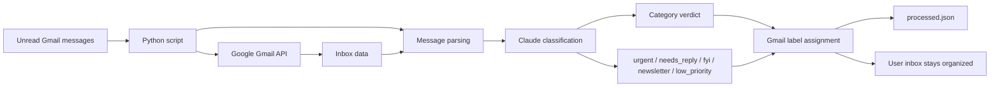

# Email Triage Architecture

## How it works

1. The script queries unread Gmail messages from the inbox.
2. It fetches message metadata and body content using the Gmail API.
3. The email is normalized and trimmed for classification.
4. Claude receives the email with a strict system prompt and returns one category.
5. The script maps the category to a Gmail label such as `Triage/Urgent` or `Triage/FYI`.
6. The message gets the label added.
7. The message ID is recorded locally in `processed.json` to avoid duplicate triage.

## Key design idea

The system is intentionally narrow and safe:

- it only adds labels
- it never deletes or sends email
- it uses a local processed file to make reruns idempotent
- it allows easy human review if a classification looks wrong
